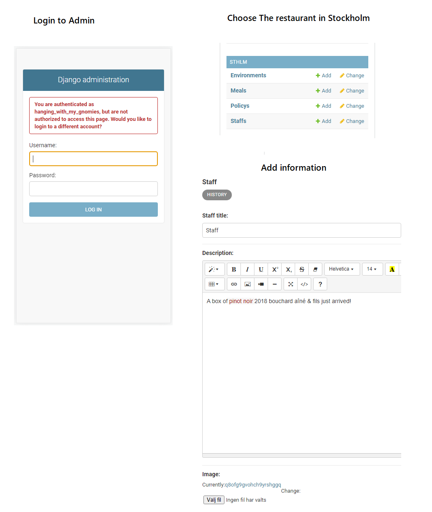
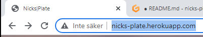

# Nicks Plate

Welcome to Nicks Plate. This is a prototype of a hip restaurant that hopefully will engage both employees and the customers. 
I feel that the web is crowded with both clicks here and information there. So much that It sometimes feels misleading. 
Information on this website for the customer is about 

- __Chef Today's Dish__

- __Staff Input__

- __Enviroment Input__

- __Policy__

## Features 

The welcoming front hopefully gives the customer a feeling that the water moves but is calm. 
Beneath the front is a short briefing of the soul of the restaurant, there is also a schedule that can 
be seen if you sign in. 

### Extra Features

The website is built in Django and from *the Djangos Admin page* employees can upload new information to the website. 
Image information and text will be saved in separate servers. 

- [Django Admin](http://nicks-plate.herokuapp.com/admin/login/?next=/admin/)

### Validation 

- No problems have been detected in the workspace.

### Package of use 

asgiref==3.5.2  
cloudinary==1.29.0  
dj-database-url==0.5.0  
dj3-cloudinary-storage==0.0.6  
Django==3.2.13  
django-allauth==0.51.0  
django-summernote==0.8.20.0  
gunicorn==20.1.0  
oauthlib==3.2.0  
psycopg2==2.9.3  
PyJWT==2.4.0  
python3-openid==3.2.0  
pytz==2022.1  
requests-oauthlib==1.3.1  
sqlparse==0.4.2  

### Deplyment

This site is deployed through Heroku, Heroku connects to the GitHub repository, Cloudinary, and Heroku Postgres.

The live link can be found here - http://nicks-plate.herokuapp.com/

### Unfixed Bugs 

My browser says that the website is not safe, unsure why.

### Credits

Credits go out to the team of Code Institute, this is made thanks to their examples and expertise. If you like to learn more about code, you should visit 
- https://codeinstitute.net/ 

### Media 

Some of the Image used here is from 
- https://pixabay.com/

## thanks for stepping by

