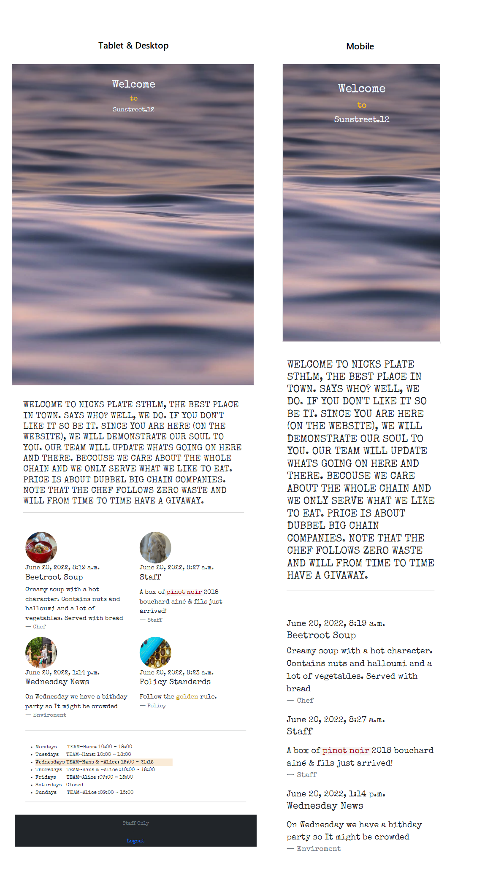
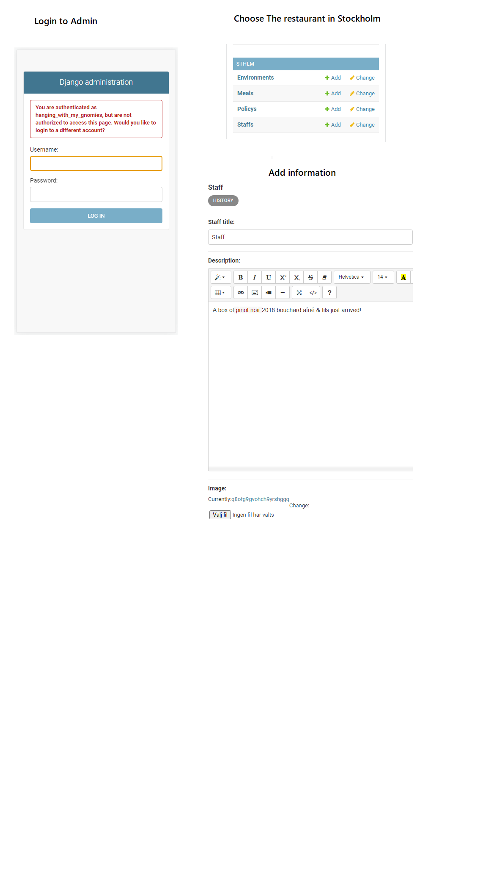

# Nicks Plate

Welcome to Nicks Plate. This is a prototype of a hip restaurant that hopfully will engage both employee and the costumers. 
Personaly I feel that the web is crouded with both clicks here and information there. So much that It sometimes feels misleading. 
Information in this website for the custumer is about 

- __Chef Today's Dish__

- __Staff Input__

- __Enviroment Input__

- __Policy__

## Features 

The welcoming front hopfully gives the costumer a feeling that the water moves but is calm. 
Beneath the fron is a short briefing of the soul of the restaurant, there is also a schedule that can 
be seen if you sign in. 

### Extra Features

The website is built in Django and from *Djangos Admin page* employee can upload new information to the website. 
Imnage information and text will be saved in separate servers. 

- [Django Admin](http://nicks-plate.herokuapp.com/admin/login/?next=/admin/)

